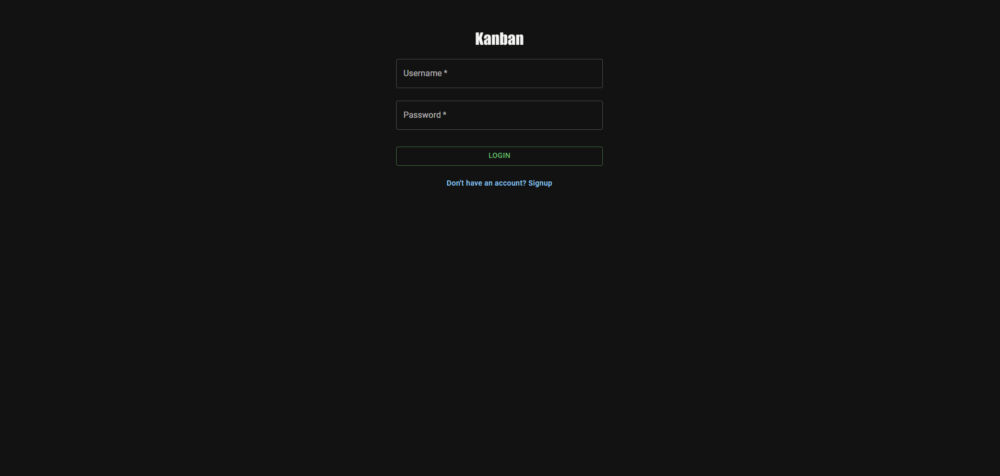
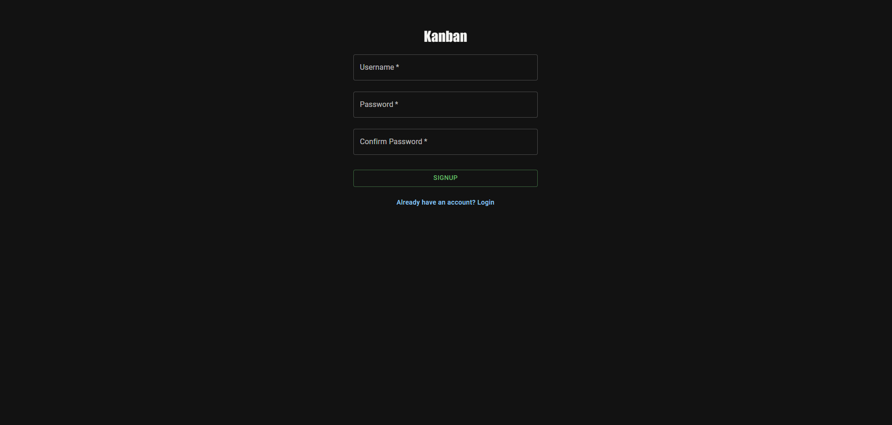
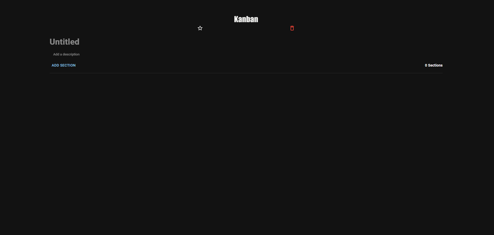

# Kanbem-app




Kanbem-app is a task management application based on the Kanban method. It allows users to create and organize boards with lists of tasks, providing features such as adding, editing, moving, and deleting tasks within these boards. The application is designed to help users manage their tasks efficiently with a visual and flexible approach.

## Technologies Used

- **Frontend:**
  - React
  - React Router
  - Material-UI
  - Redux

- **Backend:**
  - Node.js
  - Express
  - MongoDB (with Mongoose)
  - JWT (JSON Web Tokens)
  - Bcrypt (for password hashing)

## Features

- **Boards Management:**
  - Create, Read, Update, Delete boards
  - Add, Edit, Move, Delete tasks within boards
  - Mark tasks as completed

- **User Authentication:**
  - User registration with username and password
  - User login/logout
  - JWT-based authentication for secure API access

## Getting Started

To run the application locally, follow these steps:

1. **Clone the repository:**
   ```bash
   git clone https://github.com/edulon2000/Kanbem-app.git
   ```

2. **Install dependencies:**
   ```bash
   cd Kanbem-app
   npm install   # Install backend dependencies
   cd client
   npm install   # Install frontend dependencies
   cd ..
   ```

3. **Set up environment variables:**
   - Create a `.env` file in the root directory with the following variables:
     ```plaintext
     PORT=5000         # Port number for the backend server
     MONGODB_URI=<your_mongodb_uri>
     JWT_SECRET=<your_jwt_secret>
     ```

4. **Run the application:**
   ```bash
   npm run dev   # Runs both backend and frontend concurrently
   ```

5. **Access the application:**
   Open your web browser and go to `http://localhost:3000` to view the application.

## Contributing

Contributions are welcome! If you find any issues or have suggestions for improvement, please create an issue or submit a pull request.

## License

This project is licensed under the MIT License - see the [LICENSE](LICENSE) file for details.

## Acknowledgments

- This project was created as a practical exercise in full-stack web development using React, Node.js, and MongoDB.
- Thanks to [Material-UI](https://mui.com/) for providing a great set of UI components.

---

Feel free to customize this README with additional sections or information specific to your project!

Acknowledgments
This project was created as a practical exercise in full-stack web development using React, Node.js, and MongoDB.
Thanks to Material-UI for providing a great set of UI components.
